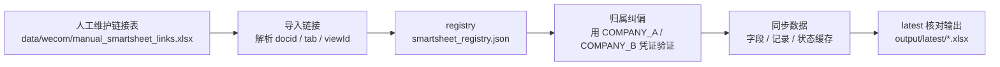

# 企业微信智能表格入口

日常只推荐从统一主入口开始：

```powershell
python apps/wecom_smartsheet_qiyeweixin/B00A_wecom_smartsheet_manager_qiyeweixin.py
```

输入数字即可：

```text
0 = 标准流程：导入人工链接 -> 纠正归属公司 -> 同步双公司 -> 刷新 latest
1 = 只导入人工链接清单，并补全 docid / sheet_id
2 = 只验证并纠正 registry 里的归属公司 env_profile
3 = 只同步 COMPANY_A / COMPANY_B
4 = 只重新生成 output/latest/document_inventory.xlsx
5 = 创建/刷新人工链接清单模板
```

如果要定时运行或无人值守，使用：

```powershell
python apps/wecom_smartsheet_qiyeweixin/B00A_wecom_smartsheet_manager_qiyeweixin.py --mode 0 --non-interactive
```

## 推荐数据流



这个目录仍保留拆分脚本，主要用于高级调试、单步排错和兼容旧流程。

## 同步排错顺序

1. `data/wecom/manual_smartsheet_links.xlsx`：确认链接是否填写、是否启用。
2. `smartsheet_registry.json`：确认 `docid`、`sheet_id`、`env_profile` 是否正确。
3. `output/latest/wecom_smartsheet_profile_verification.xlsx`：确认归属公司验证结果。
4. `data/wecom/smartsheet/<docid>/<sheet_id>/records_merged_latest.json`：确认记录缓存是否刷新。
5. `output/latest/wecom_two_company_sync_summary.json`：确认最近一次同步摘要和错误码。
6. `output/latest/document_inventory.xlsx`：用表格方式核对所有登记表和缓存表状态。

| 文件 | 功能 | 常见用途 |
|---|---|---|
| `B00A_wecom_smartsheet_manager_qiyeweixin.py` | 统一主入口：菜单化执行导入链接、纠正归属、同步双公司、刷新核对表 | 日常唯一推荐入口 |
| `B00_wecom_verify_server_qiyeweixin.py` | 启动企业微信回调校验服务，用配置中的 token 和 AESKey 验证服务器回调 | 配置企微接收消息服务器 URL 时验证链路 |
| `B01_wecom_smartsheet_registry_qiyeweixin.py` | 整理企业微信智能表格登记信息，生成本地 `smartsheet_registry.json` | 新增或刷新智能表格登记信息 |
| `B01A_wecom_smartsheet_import_links_qiyeweixin.py` | 从人工维护的智能表格访问链接清单导入 docid，并自动补全 sheet_id、创建者、创建时间等核对信息 | 你知道文档链接，但不想依赖微盘空间发现时 |
| `B01B_wecom_smartsheet_verify_profiles_qiyeweixin.py` | 用 A/B 公司 `.env` 凭证逐个验证 registry 中 docid 的真实可访问公司，并自动纠正 `env_profile` | 发现表格归属公司登记错了时 |
| `B02_wecom_smartsheet_sync_qiyeweixin.py` | 默认 `full` 完整同步字段、记录和状态到 `data/`，也支持 `auto`、`recent`、`verify` | 日常同步企业微信表格数据 |
| `B02A_wecom_smartsheet_sync_two_companies_qiyeweixin.py` | 同步 `COMPANY_A` 和 `COMPANY_B`，默认跳过已失效历史 docid，并输出同步摘要 | 推荐的双公司稳定同步入口 |
| `B03_wecom_smartsheet_templates_qiyeweixin.py` | 读取字段和样例数据，辅助生成排产模板或调试字段结构 | 调整表字段、模板或排产字段映射前检查结构 |
| `B04_wecom_smartsheet_read_qiyeweixin.py` | 直接读取指定智能表格内容 | 排查接口返回、字段和值结构 |

## 常用命令

```powershell
python apps/wecom_smartsheet_qiyeweixin/B00A_wecom_smartsheet_manager_qiyeweixin.py
python apps/wecom_smartsheet_qiyeweixin/B00A_wecom_smartsheet_manager_qiyeweixin.py --mode 0 --non-interactive
python apps/wecom_smartsheet_qiyeweixin/B00A_wecom_smartsheet_manager_qiyeweixin.py --mode 5
python apps/wecom_smartsheet_qiyeweixin/B02_wecom_smartsheet_sync_qiyeweixin.py
python apps/wecom_smartsheet_qiyeweixin/B02_wecom_smartsheet_sync_qiyeweixin.py --mode full
python apps/wecom_smartsheet_qiyeweixin/B02_wecom_smartsheet_sync_qiyeweixin.py --mode auto
python apps/wecom_smartsheet_qiyeweixin/B02_wecom_smartsheet_sync_qiyeweixin.py --mode recent --recent-limit 50
python apps/wecom_smartsheet_qiyeweixin/B02_wecom_smartsheet_sync_qiyeweixin.py --mode verify
python apps/wecom_smartsheet_qiyeweixin/B02_wecom_smartsheet_sync_qiyeweixin.py --all --mode full
python apps/wecom_smartsheet_qiyeweixin/B02A_wecom_smartsheet_sync_two_companies_qiyeweixin.py
python apps/wecom_smartsheet_qiyeweixin/B01A_wecom_smartsheet_import_links_qiyeweixin.py
python apps/wecom_smartsheet_qiyeweixin/B01B_wecom_smartsheet_verify_profiles_qiyeweixin.py
```

不带参数运行时会完整拉取目标智能表格。同步结果摘要中的 `is_full_fetch=true` 表示本次已取完整数据。

完整同步成功后，会额外生成便于人工核对的完整表格：

```text
output/latest/wecom_smartsheet_full.xlsx
output/latest/wecom_smartsheet_full.csv
```

## 人工链接清单导入

如果后台拿不到微盘 `spaceid`，可以人工维护一个链接表，让程序补齐企业微信 API 需要的 `docid` / `sheet_id`：

```powershell
python apps/wecom_smartsheet_qiyeweixin/B01A_wecom_smartsheet_import_links_qiyeweixin.py --init-template
```

模板位置：

```text
data/wecom/manual_smartsheet_links.xlsx
```

填写列：

```text
company_profile, company_name, doc_name, url, enabled, remark
```

运行导入后会刷新：

```text
smartsheet_registry.json
output/latest/wecom_smartsheet_link_inventory.xlsx
output/latest/wecom_smartsheet_link_inventory.csv
output/latest/document_inventory.xlsx
output/latest/document_inventory.csv
```

`url` 中的 `scode`、`token`、`sid`、`ticket` 等敏感参数不会写入 registry 或核对表。核对表会尽量保留接口返回的 `creator_name`、`creator_userid`、`create_time`、`update_time`、`sheet_id`、`sheet_name` 等字段；如果企业微信接口没有返回某项，就保持为空。

## 表格归属公司纠偏

如果 `smartsheet_registry.json` 里某些 docid 被登记到了错误公司，运行：

```powershell
python apps/wecom_smartsheet_qiyeweixin/B01B_wecom_smartsheet_verify_profiles_qiyeweixin.py
```

手动输入：

```text
0 = 只验证 registry 并自动纠正 env_profile
1 = 先纠正 env_profile，再同步 COMPANY_A / COMPANY_B
```

脚本会分别使用 `COMPANY_A`、`COMPANY_B` 的 `.env` 凭证调用企业微信 `get_sheet`。哪个公司能成功访问该 docid，就把该文档的 `env_profile` 修正为对应公司，并刷新：

```text
output/latest/wecom_smartsheet_profile_verification.xlsx
output/latest/wecom_smartsheet_profile_verification.csv
output/latest/document_inventory.xlsx
output/latest/document_inventory.csv
```

## 多公司切换

在 `.env` 里用 `WECOM_ENV_PROFILE` 选择当前企业微信公司：

```dotenv
WECOM_ENV_PROFILE=COMPANY_A

WECOM_COMPANY_A_CORP_ID=wwxxxxxxxxxxxxxxxx
WECOM_COMPANY_A_ADMIN_USERID=your_admin_userid
WECOM_COMPANY_A_APP_SECRET=replace-me
WECOM_COMPANY_A_CALLBACK_TOKEN=replace-me
WECOM_COMPANY_A_CALLBACK_AESKEY=replace-me
WEDOC_COMPANY_A_DOCID=sample_docid_a
WEDOC_COMPANY_A_SHEET_ID=sample_sheet_id_a
SMARTSHEET_COMPANY_A_ID=sample_docid_a
SMARTSHEET_COMPANY_A_SHEET_ID=sample_sheet_id_a

WECOM_COMPANY_B_CORP_ID=wwyyyyyyyyyyyyyyyy
WECOM_COMPANY_B_ADMIN_USERID=your_admin_userid
WECOM_COMPANY_B_APP_SECRET=replace-me
WEDOC_COMPANY_B_DOCID=sample_docid_b
WEDOC_COMPANY_B_SHEET_ID=sample_sheet_id_b
```

如果同一家公司有多个企业微信应用会创建智能表格，可以继续追加应用 Secret，脚本会逐个应用尝试发现和同步：

```dotenv
WECOM_COMPANY_A_APP_SECRET=primary-secret
WECOM_COMPANY_A_APP_SECRET_2=another-app-secret
WECOM_COMPANY_A_APP_SECRETS=third-secret;fourth-secret
```

`--all` 会合并三个来源：当前公司 `.env` 中显式配置的 docid、`smartsheet_registry.json` 里归属于当前公司的 docid、以及 `WEDRIVE_COMPANY_A_SPACEIDS` / `WEDRIVE_COMPANY_B_SPACEIDS` 配置的微盘空间中能发现的 docid。微盘空间可用英文分号分隔多个：

```dotenv
WEDRIVE_COMPANY_A_SPACEIDS=spaceid_1;spaceid_2
```

## 双公司稳定同步

日常推荐直接运行：

```powershell
python apps/wecom_smartsheet_qiyeweixin/B02A_wecom_smartsheet_sync_two_companies_qiyeweixin.py
```

这个入口会同时同步 `COMPANY_A` 和 `COMPANY_B`，默认 `mode=auto`，并跳过已经确认 `invalid_docid` / `no_access` 的历史登记表，避免旧表错误反复刷屏。运行后会刷新：

```text
output/latest/document_inventory.csv
output/latest/document_inventory.xlsx
output/latest/wecom_two_company_sync_summary.json
```

如果摘要里出现 `errcodes={"60020": ...}`，说明当前公网出口 IP 没有加入企业微信应用的“企业可信 IP”。摘要的 `from_ips` 会列出企业微信看到的出口 IP。要稳定同步，建议在固定公网出口（云服务器 EIP、固定宽带出口、NAT 网关 EIP）上运行脚本；家用/办公网络出口 IP 变化时，需要重新加入可信 IP。

如果需要重新追查旧 registry 里的失效 docid，再加：

```powershell
python apps/wecom_smartsheet_qiyeweixin/B02A_wecom_smartsheet_sync_two_companies_qiyeweixin.py --include-invalid
```

切换到另一家公司时，只改：

```dotenv
WECOM_ENV_PROFILE=COMPANY_B
```

脚本会优先读取带公司名的变量；如果没设置公司档案，仍兼容旧的 `WECOM_CORP_ID`、`WECOM_APP_SECRET`、`WEDOC_DOCID`、`SMARTSHEET_ID` 等变量。

## 企业可信 IP

截图里的“企业可信 IP”配置的是调用企业微信接口的服务器公网出口 IP，不是域名验证。你的服务器在美国、域名无法备案时，日常拉取智能表格数据可以走这条路：把阿里云服务器的固定公网 IPv4、EIP 或 NAT 网关出口 IP 填进去。

在 Linux 服务器上查看公网出口 IP：

```bash
curl -4 https://api.ipify.org
```

如果服务器有 EIP，填 EIP；如果通过 NAT 网关出网，填 NAT 网关绑定的 EIP；如果后面用了代理或负载均衡，填最终访问 `qyapi.weixin.qq.com` 的出口 IP。多个 IP 用英文分号 `;` 分隔。

`B00_wecom_verify_server_qiyeweixin.py` 只用于“接收消息服务器 URL”回调校验，需要一个能被企业微信访问到的 HTTP/HTTPS 地址；它不能替代“企业可信 IP”。设置可信 IP 后，直接在服务器运行 `B02_wecom_smartsheet_sync_qiyeweixin.py` 测试即可。

## 相关核心模块

- `peifang_core/wecom.py`：企业微信 token、字段、记录同步和本地缓存逻辑。
- `peifang_core/common.py`：路径、JSON 读写、记录合并和多公司环境配置。
