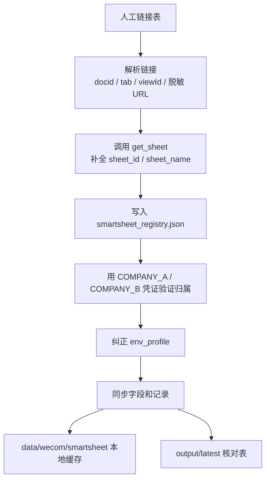

# 企业微信智能表格同步设计

## 目标

把两家公司企业微信自建应用创建或可访问的智能表格，稳定同步到本地缓存，并在 `output/latest` 生成便于人工核对的最新清单。

## 日常入口

日常只运行：

```powershell
python apps/wecom_smartsheet_qiyeweixin/B00A_wecom_smartsheet_manager_qiyeweixin.py
```

推荐模式：

```text
0 = 标准流程：导入人工链接 -> 纠正归属公司 -> 同步双公司 -> 刷新 latest
```

无人值守运行：

```powershell
python apps/wecom_smartsheet_qiyeweixin/B00A_wecom_smartsheet_manager_qiyeweixin.py --mode 0 --non-interactive
```

## 核心数据源

| 文件 | 作用 |
|---|---|
| `.env` | 保存 `COMPANY_A` / `COMPANY_B` 的企业微信 `CORP_ID`、`APP_SECRET`、管理员 userid、可信 IP 相关配置 |
| `data/wecom/manual_smartsheet_links.xlsx` | 人工维护的智能表格链接清单，用于发现和补充 registry |
| `smartsheet_registry.json` | 本地登记中心，保存 docid、sheet_id、归属公司、访问状态、云端 sheet 元数据 |

## 标准流程



## 输出文件

| 文件 | 用途 |
|---|---|
| `output/latest/wecom_smartsheet_manager_summary.json` | 主入口每次运行的总摘要 |
| `output/latest/wecom_smartsheet_link_inventory.xlsx` | 人工链接导入结果，含 docid、sheet_id、创建者、创建时间等可用元数据 |
| `output/latest/wecom_smartsheet_profile_verification.xlsx` | 归属公司验证和纠偏结果 |
| `output/latest/wecom_two_company_sync_summary.json` | 双公司同步摘要 |
| `output/latest/document_inventory.xlsx` | 所有登记表和缓存表的总核对清单 |
| `output/latest/wecom_smartsheet_full.xlsx` | 最近一次完整导出的同步数据表 |

## 入口分层

| 层级 | 脚本 | 定位 |
|---|---|---|
| 日常主入口 | `B00A_wecom_smartsheet_manager_qiyeweixin.py` | 首选入口，菜单化运行 |
| 单步入口 | `B01A` / `B01B` / `B02A` | 排错或只执行某一步时使用 |
| 兼容/高级入口 | `B01` / `B02` / `B03` / `B04` | 保留旧流程和底层调试能力 |
| 回调验证 | `B00` | 仅用于企业微信接收消息服务器 URL 校验 |

## 设计原则

- 人工可见的文档链接作为发现入口，不再强依赖微盘 `spaceid`。
- `smartsheet_registry.json` 是唯一登记中心，所有同步都从这里取候选 docid。
- 公司归属不靠人工猜，统一用 A/B 两套 `.env` 凭证调用 `get_sheet` 验证。
- `output/latest` 永远保存最新核对表，历史文件进入 `output/archive`。
- 旧脚本先保留，避免一次性删除造成可用流程断裂；后续稳定后再归档。
